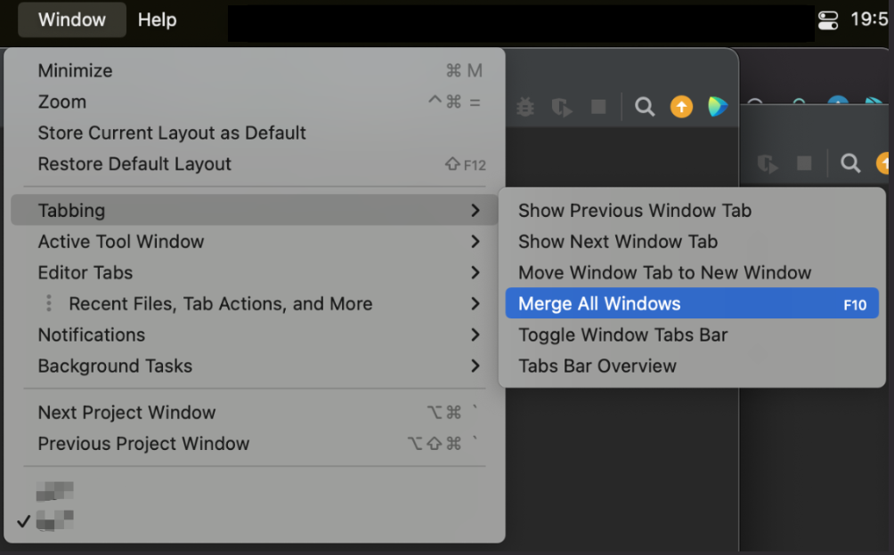

# Mac Tab Support

<!-- Plugin description -->
Based on the plugin by [wDCat](https://github.com/wDCat) available at <https://github.com/wDCat/idea-mac-tabbing>

Add Mac tabbing options to JetBrains IDEs:
- Show Previous Window Tab
- Show Next Window Tab
- Move Window Tab to New Window
- Merge All Windows
- Toggle Window Tabs Bar
- Tabs Bar Overview

<!-- Plugin description end -->

---
Plugin based on the [IntelliJ Platform Plugin Template][template].

[template]: https://github.com/JetBrains/intellij-platform-plugin-template

Icon by <svgrepo.com>
